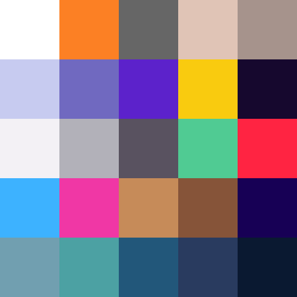

# [TRUE:COLORS]

<div align=center>



<small>`image above by me / done using Figma and Canva`</small>

[I'm working on it here!](https://themes.vscode.one/)

</div>

--- 

```js
const damage: boolean = true;
```

A colorful skinline for Visual Studio Code, based on the legendary **True Damage** skinline from **League of Legends**! Supports most languages, including, but not limited to: CSS, JS, TypeScript, HTML, PHP, Ruby, YAML, Markdown, Python, Ruby, Java, C#, Scala and more. 

The colors are mostly based on the Electron/One Dark Pro/Material Themes, plus more colors sourced from [Coolors](coolors.co) and [Color Hunt](colorhunt.com). This was once my personal theme so there're a lot of colors in there.

These are my first themes, so make sure to let me know if you see something off or out of place, or even don't work well, and I'll try to find time to fix it.

## What's Inside / Who's the Crew? 

> Sorry if my English writing skills are bad...

### Akali

:no_upscale()/cdn.vox-cdn.com/uploads/chorus_asset/file/19325206/Akali_Splash_12.jpg)

> A badass mix of orange, grey, camo and white, inspired by the founder of the True Damage crew, the rapper _Akali_, from K/DA!

### Ekko (+ Neon)

:no_upscale()/cdn.vox-cdn.com/uploads/chorus_asset/file/19325205/Ekko_Splash_6.jpg)

> It's rewind time. Code in the dark like you're the boy genius _Ekko_. Comes in two flavors: Neon and Regular, all in yellow, navy and cobalt blue.

### Senna (+ Prestige)


> Bring yourself back to the spotlight with a green/red theme inspired by the one and only lead singer _Senna_. 

### Qiyana (+ Prestige)


> This one's for the ladies. Impress your friends with _Qiyana_'s signature theme, of cyan, magenta and golden yellow. 

### Yasuo (+ Prestige)


> Get laidback with _Yasuo_'s cool blue and turquoise look. Engineer your software like how he engineers his beats.

### Recommended Settings 

The theme is designed to work with the


If you want to steal this look, [Cascadia Code](https://github.com/microsoft/cascadia-code) at **500 weight**, then paste this code snippet in your `settings.json` file:

```json
{
  "editor.fontFamily": "Cascadia Code, monospace",
  "editor.fontLigatures": "'ss01', 'ss20'", // insert your own custom configuration here
  "editor.fontSize": 13,
  "editor.letterSpacing": -0.5
}
```

### Installation :arrowdown:

- Install and launch Visual Studio Code
- Click on the Extensions Icon
- Search for `true colors`
- Click `Install`, then `Set Color Theme`
- Select what theme you want to use from the dropdown

If you want to switch themes:

- Navigate to Code > Preferences > Color Theme, then type `true colors`. You should see five themes.
- Then select `True Colors: ${True Damage member}` from the dropdown

## Palette 🎨

## Extension Pack 📦

Once this theme is published on Visual Studio Code, it will also be available as an extension pack.

- **Babel JavaScript** - syntax highlighting for Babel JavaScript. Also supports some experimental JavaScript features, and support for Flow, GraphQL and Styled Components.
- **Better Syntax** pack by Jeff Hykin
- **Markdown All-in-One** for better Markdown syntax
- **Bracket Pair Colorizer 2** - highlights different pairs or levels if brackets with different colors - also enables custom color sets)
- **Rainbow Tags** - XML/HTML tags
- **Indent Rainbow** - highlights different levels of indentation with different colors
- **Better Comments** - labelling your comments with different symbols gives them unique colors
- **Colorize** - highlights CSS colors - hexadecimal, RGBA, HSL and HSV
- **Comment Tagged Templates** - embedded highlighting for different types of languages in commented JavaScript ES6 template strings

### License

Copyright &copy; 2021 NoxUltima

